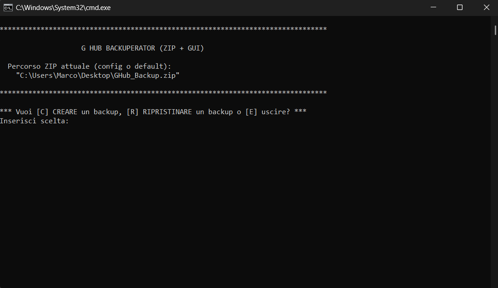
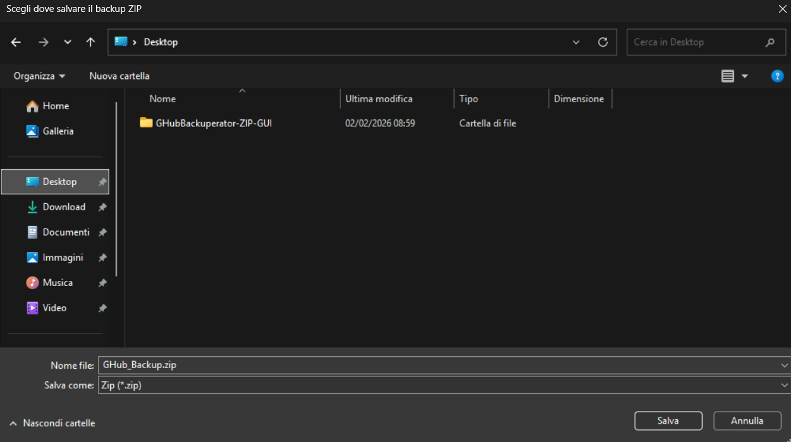

# GHub Backuperator (ZIP + GUI) 🇮🇹 | 🇬🇧 below

Utility Windows (.bat) per fare backup e restore delle impostazioni/profili di Logitech G Hub senza account.

\## Funzioni

\- Backup in un unico file `.zip`

\- Restore da `.zip`

\- Scelta percorso con finestre “Salva” / “Apri”

\- Ricorda l’ultimo percorso usato (config in `%LocalAppData%`)

\- Chiude i processi G Hub prima di operare

\- Richiede privilegi amministratore (ProgramData)

\## Cosa viene salvato

\- `%LocalAppData%\\LGHUB\\`

\- `%AppData%\\G HUB\\`

\- `%AppData%\\lghub\\`

\- `%ProgramData%\\LGHUB\\`

\## Come si usa

Esegui lo script come amministratore e scegli:

\- `C` = crea backup

\- `R` = ripristina backup

\## Note

Usa PowerShell integrato (Compress-Archive / Expand-Archive) e WinForms per le finestre.

---

# GHub Backuperator (ZIP + GUI) 🇬🇧 

A small Windows batch utility to **backup and restore Logitech G Hub profiles and settings** into a single ZIP file — without needing a Logitech account.

## Features

- Backup G Hub profiles into one `.zip` file  
- Restore profiles from a `.zip` backup  
- Simple GUI to choose where to save or load the backup  
- Remembers last used path (saved in `%LocalAppData%`)  
- Automatically closes G Hub processes before backup/restore  
- Uses only built-in Windows tools (Batch + PowerShell)

## What gets backed up

- `%LocalAppData%\LGHUB\`
- `%AppData%\G HUB\`
- `%AppData%\lghub\`
- `%ProgramData%\LGHUB\`

## How to use

1. Run the script **as Administrator**
2. Choose:
   - `C` → Create a backup
   - `R` → Restore from a backup
3. Use the file picker window to select where to save or load the ZIP file

## Notes

This project is open-source and uses only native Windows components.  
You can inspect the code before running it.

## 📸 Screenshots

### Main menu

### Backup file selection

